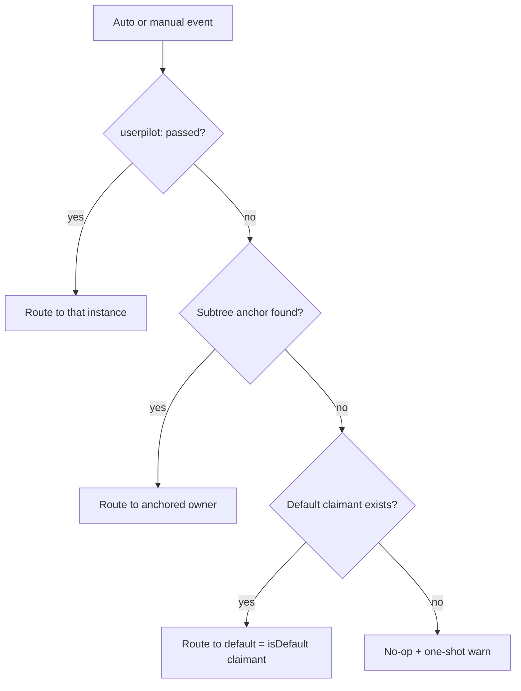

# Multi-Instance Userpilot (iOS)

The Userpilot iOS SDK supports running **multiple independent instances inside the
same process**. The most common reason to need this is the "vendor SDK" pattern:

> An app integrates Userpilot directly to track its own users.
> The same app integrates a vendor SDK that itself bundles Userpilot to track
> *its* users. Both instances must coexist without stomping on each other's
> analytics, autocapture, storage, or experience UI.

> [!IMPORTANT]
> **If you only have one Userpilot instance in your app, nothing changes.**
> Keep using the `Userpilot` instance returned by `Userpilot(config:)`. The SDK
> still resolves unattributed autocapture and screen-tracking events through the
> instance that claimed the default role (`isDefault`, which defaults to `true`).

---

## Quick reference

| Scenario | Use |
| --- | --- |
| Single instance (host app only) | `Userpilot(config:)` — `isDefault` defaults to `true`, so the host claims default automatically |
| Vendor SDK that embeds Userpilot | `Userpilot(config:)` inside the vendor's facade with `.defaultInstance(false)` |
| Re-initialise idempotently | `Userpilot(config:)` again — returns the existing instance for the same token |

`Userpilot.Config.isDefault` defaults to **`true`**. The host application does not
need to call `.defaultInstance(true)` — a plain `Userpilot.Config(token:)` already
claims the default role. Embedded vendor SDKs **MUST** call
`.defaultInstance(false)` so they do not compete for that role.

The two SDK initialisation factories that used to exist on iOS
(`Userpilot(config:)` and `Userpilot.create(config:)`) have been collapsed
into a single `Userpilot(config:)`. Because `isDefault` defaults to `true`,
an instance claims the default role on registration when the role is unclaimed.
Subsequent calls with the same token return the existing instance instead of
replacing it. A second instance with a **different** token that also leaves
`isDefault` at its default cannot displace an existing claimant — the SDK
logs a warning and un-anchored events keep routing to whoever already holds
the role.

---

## Mental model: one routing rule

Every event — autocapture interaction, autocapture screen, or a manual
`screen(_:)` / `track(_:)` — is routed to a Userpilot instance using a single
three-tier rule:

1. **Explicit `userpilot:` argument**, when the API exposes one (e.g.
   `View.userpilotScreen(_:userpilot:)`).
2. **Anchored owner**, when something in the UI hierarchy claims the
   originating UI (`Config.attach(viewControllerClasses:)`,
   `Config.attach(windows:)`, `Config.attach(bundles:)`).
3. **Default**, which is the instance that claimed `isDefault` (defaults to
   `true`; the default claimant).

If none of those resolve to a live instance, the event is a silent no-op and
a one-shot warning is written to `os_log` so the misconfiguration is
discoverable in Console / Sysdiagnose.



No fan-out. No screen-vs-interaction policy split. In the single-instance case
the only registered instance claims the default automatically (`isDefault`
defaults to `true`), so nothing in your integration changes.

---

## Single-instance integration (no change)

```swift
let config = Userpilot.Config(token: "YOUR_TOKEN")
    .logging(enabled: true)
    .enableScreenAutoCapture()
    .enableInteractionAutoCapture()

let userpilot = Userpilot(config: config)        // isDefault defaults to true → claims default
userpilot.identify(userId: "user-123")
userpilot.track(eventName: "Added to Cart")
```

No `.defaultInstance(true)` is required — `isDefault` already defaults to
`true`, so the host app's plain `Config` claims the default role on init.

---

## Multi-instance integration

### 1. Vendor SDK that embeds Userpilot

If you ship an SDK that uses Userpilot internally, initialise with
`Userpilot(config:)` from inside your SDK. The factory is **idempotent**, so
re-calls with the same token return the existing instance instead of replacing
the host app's default.

```swift
public final class AcmeSDK {
    public static let shared = AcmeSDK()

    private let userpilot: Userpilot

    private init() {
        let config = Userpilot.Config(token: "ACME_VENDOR_TOKEN")
            .defaultInstance(false)            // ← vendor is NOT the default
            .enableScreenAutoCapture()
            .enableInteractionAutoCapture()
            // ↓ tells autocapture which UI belongs to this instance
            .attach(bundles: [Bundle(for: AcmeSDK.self)])

        userpilot = Userpilot(config: config)
    }

    public func identifyAcmeUser(_ id: String) {
        userpilot.identify(userId: id)
    }
}
```

Key points:

- **`isDefault` defaults to `true`.** Every `Config` attempts to claim the
  default role on registration unless you opt out. A vendor SDK **MUST** call
  `.defaultInstance(false)` so it does not compete for that single slot.
  When every instance opts out (`defaultInstance(false)` everywhere),
  there is no default and un-anchored events are dropped.
- Default resolution is **claim-based, not registration-order-based**: the
  instance that successfully holds the `isDefault` claim becomes the SDK's
  default fallback. Init order between host and vendor does not matter when the
  vendor opts out; only one claimant is allowed at a time, and a second
  conflicting claim is rejected (see [`isDefault` defaults to `true`](#isdefault-defaults-to-true)).
- `attach(bundles:)` is what teaches autocapture which UI events
  belong to your tenant. See [Scope semantics](#scope-semantics) below.
- The registry holds instances **weakly**, so you must keep a strong reference
  (a stored property on your facade) for the lifetime of the integration.

```swift
let config = Userpilot.Config(token: "ACME_VENDOR_TOKEN")
    .defaultInstance(false)            // ← vendor opts OUT of the default role
    .enableScreenAutoCapture()
    .enableInteractionAutoCapture()
    .attach(bundles: [Bundle(for: AcmeSDK.self)])
```

### 2. Host app + embedded vendor

Once the vendor SDK above is integrated, the host app does nothing special for
default resolution — `isDefault` defaults to `true`, so a plain `Config` is
enough:

```swift
// AppDelegate / SceneDelegate
let config = Userpilot.Config(token: "HOST_APP_TOKEN")
    .enableScreenAutoCapture()
    .enableInteractionAutoCapture()
    // no .defaultInstance(true) needed — isDefault defaults to true

_ = Userpilot(config: config)         // claims default automatically
AcmeSDK.shared.identifyAcmeUser("…")  // vendor instance kept alive by AcmeSDK
```

Both instances are now live and independent. Init order does not affect which
tenant is default as long as the vendor opts out with `.defaultInstance(false)`.

---

## Routing autocapture events: scope semantics

Autocapture events are attributed to the instance that owns the originating
UI. The SDK resolves ownership by walking the responder chain from the touched
view up to the nearest `UIViewController` and checking each registered
instance's claimed scope, **in this priority order**:

1. **`attach(viewControllerClasses:)`** — VC class match (subclass-aware).
2. **`attach(windows:)`** — the VC's containing window matches.
3. **`attach(bundles:)`** — `Bundle(for: VC.class)` identifier matches.
4. **Default fallback** — if no instance claims the source, the event routes
   to the instance that claimed `isDefault`, or is dropped
   when no instance holds the default role.

### Choosing the right `attach(...)`

| Vendor situation | Recommended attach |
| --- | --- |
| Vendor's UI lives in its own framework | `.attach(bundles: [Bundle(for: VendorClass.self)])` |
| Vendor presents on a custom `UIWindow` | `.attach(windows: [vendorWindow])` |
| Vendor's UI is mixed into the host bundle (rare) | `.attach(viewControllerClasses: [VendorVC.self])` per VC |
| Pure SwiftUI vendor view inside a generic hosting controller | `.attach(windows:)` on the overlay window the vendor presents from, or `.attach(viewControllerClasses:)` on a wrapper VC |

`.attach(...)` calls are additive — call them as many times as needed, and
they stack into a single `Config`.

### SwiftUI outward walk

`UIHostingController<MyView>` lives in `com.apple.SwiftUI`, so its bundle
never matches anything you can claim. The SDK detects a hosting / wrapper
VC by class-name heuristic (anything containing `HostingController`, plus
`UINavigationController` / `UITabBarController` containers) and walks
`viewController.parent` outward until it finds an ownable VC. This usually
recovers correctly when SwiftUI views are nested inside a UIKit container
that *is* in your bundle.

If your vendor app is pure SwiftUI with no UIKit boundary, prefer either
`.attach(windows:)` on a vendor-owned overlay window, **or** the explicit
`userpilot:` argument on the SwiftUI screen-tracking modifier described next.

---

## Routing manual SwiftUI screen events

The `View.userpilotScreen(_:userpilot:)` modifier accepts an optional explicit
`userpilot:` argument:

```swift
struct VendorSettings: View {
    let userpilot: Userpilot

    var body: some View {
        VStack { /* … */ }
            .userpilotScreen("Vendor.Settings", userpilot: userpilot)
    }
}
```

Resolution:

1. If `userpilot:` is passed, the event publishes on that instance.
2. Otherwise it publishes on the default instance.

If neither resolves, the event is a no-op.

---

## Forwarding external-source events to the host

By default each autocapture event (screen + interaction) is published only on
the instance that owns the originating UI. So a vendor-owned screen or tap is
reported to the **vendor** tenant only — the host app never sees it.

If the host app wants to be aware of autocapture events that originate inside
embedded vendor SDKs, opt in on the **host (default) instance**:

```swift
let hostConfig = Userpilot.Config(token: "HOST")
    .enableScreenAutoCapture()
    .enableInteractionAutoCapture()
    .allowReceiveEventsFromExternalSource()   // ← receive vendor-owned events too
```

Behavior when enabled:

- Whenever an autocapture event resolves to a **non-default** instance, the SDK
  publishes it to that instance as usual **and** forwards the same event to the
  default instance.
- The flag is read **only on the resolved default instance**. Setting it on a
  non-default (vendor) instance has no effect.
- The forwarded event is delivered **unchanged** through the host's publisher,
  so it is associated with the host's user/session and reported to the host's
  backend. There is no extra tagging — to the host it looks like one of its own
  autocapture events.
- The host's own events are never duplicated to itself (an instance does not
  forward to itself), and forwarding never re-routes, so there is no fan-out
  loop.

This is independent of the routing rule above: routing still decides the
owning tenant; forwarding only adds a copy to the default when the default
opted in.

---

## `isDefault` defaults to `true`

`Userpilot.Config.isDefault` defaults to **`true`**, so a host app that does
nothing special claims the default role automatically. Embedded vendor SDKs
that coexist in the same process **MUST** opt out:

```swift
let vendorConfig = Userpilot.Config(token: "VENDOR_TOKEN")
    .defaultInstance(false)          // ← vendor is NOT the default
    .enableScreenAutoCapture()
    .enableInteractionAutoCapture()
    .attach(bundles: [Bundle(for: VendorSDK.self)])
```

Only **one** instance can hold the default role at a time. An instance with
`isDefault` left at its default (`true`) claims that role on registration
**when the role is unclaimed**. If the role is already held, the new claim is
**rejected** (a warning is logged) and the **existing claimant keeps the role**.

This is **claim-based**, not registration-order-based: registering first does
not make an instance the default unless it also opts in, and there is no
first-registered fallback when every instance opts out.

**Correct setup:** the host leaves `isDefault` at its default; every embedded
vendor calls `.defaultInstance(false)`. The host then holds the default role
**regardless of init order**.

**Misconfiguration:** if two instances both leave `isDefault = true`, whichever
registers **while the role is still unclaimed** becomes the default; any later
conflicting claim is rejected. Do not rely on init order — always opt vendor
instances out.

If **no** instance claims the default role (every instance called
`.defaultInstance(false)`), un-anchored events are dropped rather than
attributed to an arbitrary tenant. Keep the default of `true` on the host app
so it owns un-anchored events.

Surviving instances are **not** auto-promoted when the default is torn down —
call `Userpilot(config:)` again with a config that leaves `isDefault` at its
default (or explicitly `.defaultInstance(true)`) to reclaim the role.

---

## Idempotent initialisation

`Userpilot(config:)` is a "get-or-create" factory. Calling it twice for the
same token returns the same instance. The `isDefault` flag on a repeat call
is ignored when the instance already exists — the original default claim (or
lack thereof) is preserved:

```swift
let a = Userpilot(config: .init(token: "HOST"))   // claims default (isDefault defaults true)
let b = Userpilot(config: .init(token: "HOST"))
// a and b share the same dependency container — same analytics, same
// storage, same socket. The supplied config on `b` is discarded and a
// diagnostic is logged.
```

This protects against accidental double-initialisation from
`SceneDelegate`/`AppDelegate` overlap.

---

## Experience presentation

Each `Userpilot` instance owns its **own dedicated overlay `UIWindow`**
(`ExperienceOverlayWindow`). When an experience triggers, it presents on that
window's root view controller, not on the host app's `keyWindow`. This means:

- **Two instances can present experiences simultaneously** — they coexist on
  different `UIWindow.Level`s and each remains independently interactive.
- **Touches outside any presented experience pass through** — the overlay
  uses passthrough hit-testing so the underlying app stays interactive when
  no experience is visible.
- **Window levels are deterministic** — `windowLevel.normal + 1 + registrationIndex`,
  so ordering is stable across launches.

---

## Storage isolation

Each instance writes into a token-namespaced `UserDefaults` suite:

```
com.userpilot.storage.<bundleId>.<token>
```

So `userId`, `pushToken`, `anonymousUserId`, session dates, etc. cannot leak
between tenants. There is no shared `UserDefaults` key path between
instances.

### v1 → v2 storage migration (first-token-wins)

If your app is upgrading from a Userpilot v1 SDK that wrote into
`com.userpilot.storage.<bundleId>` (no token), the SDK runs a one-shot,
idempotent migration the first time `Userpilot(config:)` is called:

1. **Tenant suite already at the current migration version?** Skip. The
   per-tenant `userpilot.storage.migrationVersion` key records the highest
   applied version; the fast path is `stored >= current`.
2. **The tenant suite already has known keys?** Skip (don't overwrite real
   v2 data with stale v1 data) and record the current version.
3. **Legacy data already claimed by a different token?** Record the current
   version and skip — only the **first tenant** ever absorbs legacy data.
4. **Legacy suite has no known keys?** Skip and record the current version.
5. **Legacy suite has data and is unclaimed?** Copy every known key into
   this tenant's suite, write the claim under the process-shared `__system`
   suite, then record the current version.

The first-token-wins claim guarantees that the same legacy bytes never appear
in two tenants. The version marker and claim keys
(`userpilot.storage.migrationVersion`, `userpilot.storage.legacyOwnerToken`)
are stable across SDK upgrades.
The integer version (rather than a boolean) lets future migrations branch on
the exact stored version: bump `currentMigrationVersion` and gate the new step.

---

## Push notifications

`PushNotificationAutoConfig` keeps a weak set of every registered monitor
(one per Userpilot instance):

- **Token registration** (`didRegister(deviceToken:)`) fans out to every
  monitor, so each instance can forward the token to its own backend.
- **Notification responses** (`didReceive(_:withCompletionHandler:)`) use the
  payload `app_token` to route directly to the matching `Userpilot` instance.
  Older payloads without `app_token` fall back to trying registered monitors
  until one claims the response. UIKit's "completionHandler called more than
  once" assertion is preserved.
- Re-registering the same monitor object is a no-op (deduped by object
  identity).

---

## Limitations and known caveats

- **Static autocapture flags.** UIKit method swizzles install once per
  process for the union of all instances' enabled features. This is
  unavoidable — you cannot un-swizzle. Autocapture uses each instance's
  per-feature config to filter events at delivery time, so disabling a
  feature on a specific instance is honoured even when the underlying
  swizzle is installed for another instance.
- **The default fallback is not thread-locked to a tenant.** It always points
  at the *default* claimant (`isDefault`). To act on a specific tenant, keep
  and pass the explicit `Userpilot` instance you created. When no instance holds
  the default role, there is no first-registered fallback.
- **`stopAutoCapture()` / `resumeAutoCapture()`** are per-instance methods.
  Pausing one instance leaves the others capturing.
- **`Userpilot.enableAutomaticPushConfig()`** is a process-wide swizzle;
  calling it from any instance enables it for all of them.
- **SwiftUI ownership** can be ambiguous when there is no UIKit container in
  your bundle. Prefer `.attach(windows:)` on a vendor-owned window or pass
  `userpilot:` explicitly on `View.userpilotScreen(...)` in those setups.
- **Two instances with the same token** never happens through the public
  factory — `Userpilot(config:)` is idempotent. Direct construction from
  low-level test code or reflection that bypasses the factory will trigger
  an `error`-level log on the second registration.

---

## Putting it all together

A working two-tenant integration looks like this:

```swift
// AppDelegate.swift (host app)
let hostConfig = Userpilot.Config(token: "HOST")
    .logging(enabled: true)
    .enableScreenAutoCapture()
    .enableInteractionAutoCapture()
let hostUserpilot = Userpilot(config: hostConfig) // isDefault defaults to true → claims default

// AcmeSDK.swift (vendor SDK)
let vendorConfig = Userpilot.Config(token: "ACME")
    .defaultInstance(false)              // vendor is NOT the default
    .enableScreenAutoCapture()
    .enableInteractionAutoCapture()
    .attach(bundles: [Bundle(for: AcmeSDK.self)])
let acmeUserpilot = Userpilot(config: vendorConfig)

// Both can identify, both autocapture, both can present experiences.
hostUserpilot.identify(userId: "host-42")         // → HOST tenant
acmeUserpilot.identify(userId: "acme-99")         // → ACME tenant
acmeUserpilot.track(eventName: "vendor_action")   // → ACME tenant
```

You should see two distinct streams of analytics on the Userpilot dashboards
for `HOST` and `ACME`, with autocapture events landing on whichever tenant
owns the originating UI.
